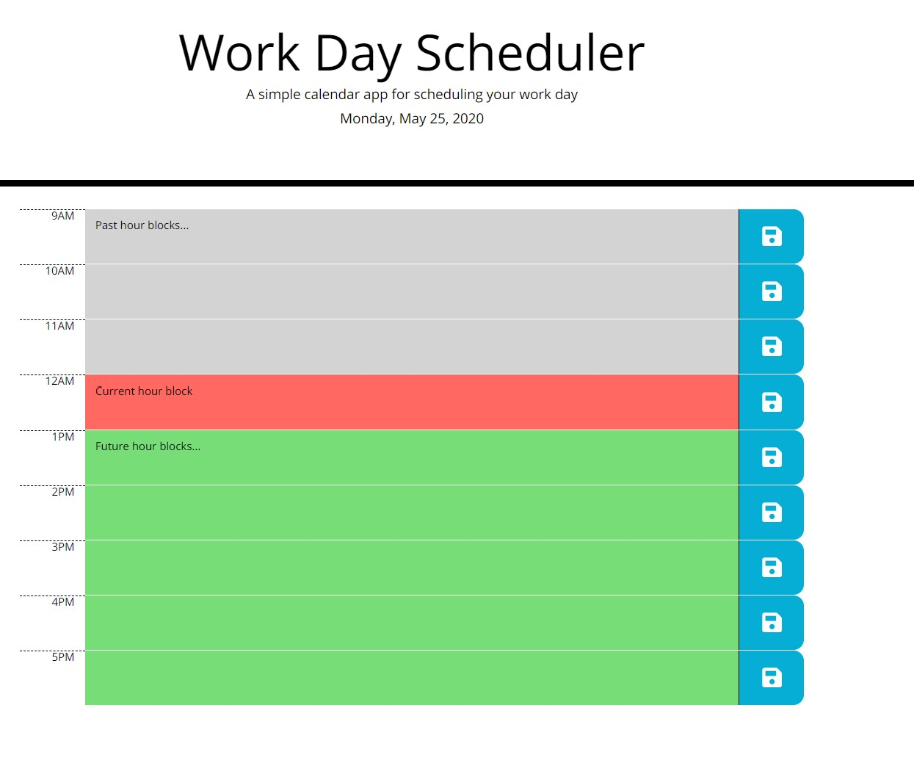

# 05 Third-Party APIs: Work Day Scheduler

This is a simple application that allows the user to update a daily workday planner. The user is able to add and save text to the planner. The saved text persists upon browser refresh.  Time blocks are color-coded relative to the current time. Live application can be viewed [here](https://rad-a.github.io/work-day-scheduler/).


## Built With
* HTML
* CSS
* JQuery
* Moment.js

## Acceptance Criteria

```
GIVEN I am using a daily planner to create a schedule
WHEN I open the planner
THEN the current day is displayed at the top of the calendar
WHEN I scroll down
THEN I am presented with timeblocks for standard business hours
WHEN I view the timeblocks for that day
THEN each timeblock is color coded to indicate whether it is in the past, present, or future
WHEN I click into a timeblock
THEN I can enter an event
WHEN I click the save button for that timeblock
THEN the text for that event is saved in local storage
WHEN I refresh the page
THEN the saved events persist
```

## Application UI

